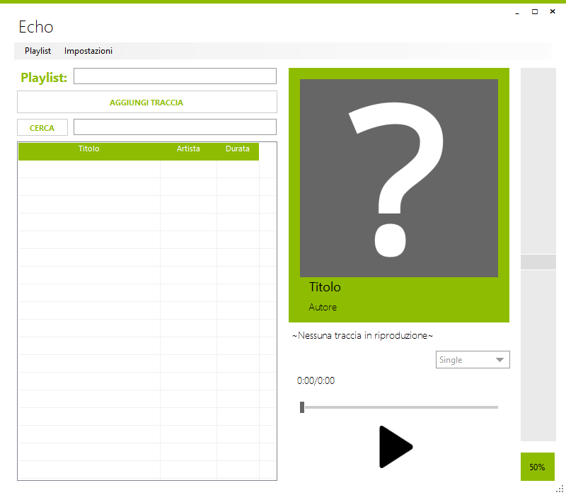
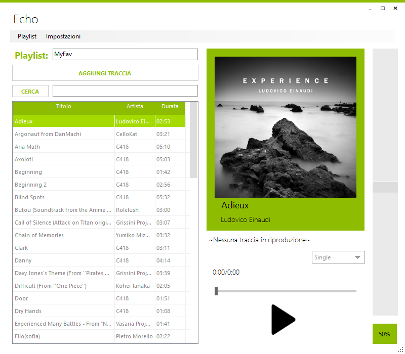
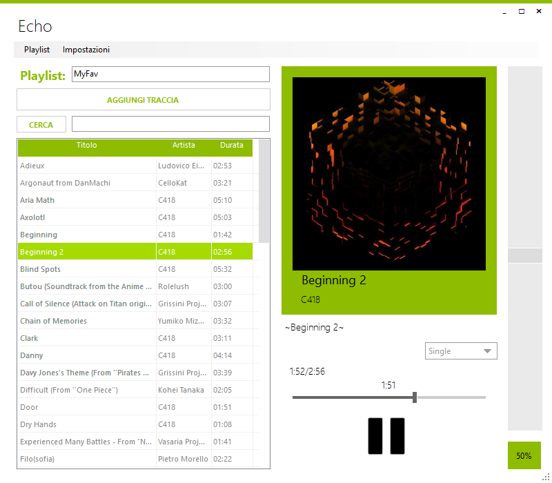
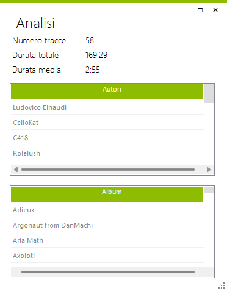
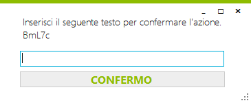
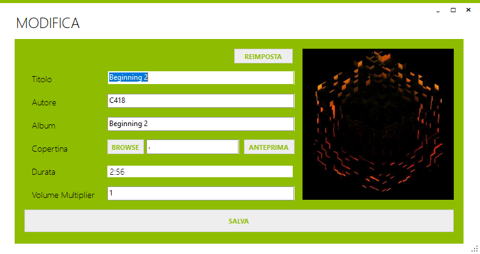
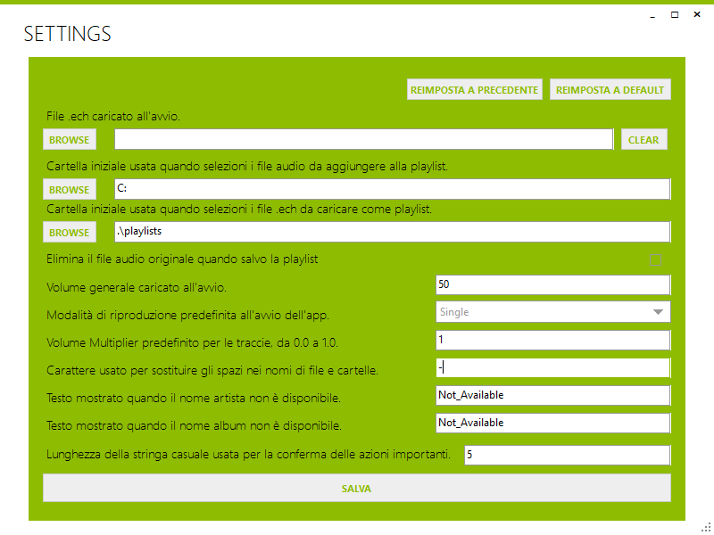

# Echo — Player MP3 locale

Mi stavo stancando dell'utilizzo di Spotify: lo usavo solo per ascoltare le solite canzoni e spesso venivo interrotto dalle pubblicità. Per questo, e anche in vista di un progetto scolastico, ho deciso di realizzare un'alternativa costruita su misura per le mie esigenze: **Echo**, un player desktop per gestire playlist locali, riprodurre MP3, modificare metadati e salvare raccolte in formato dedicato `.ech`.

Repo GitHub: [Cheng98989/Echo](https://github.com/Cheng98989/Echo.git)

## Funzionalità principali

- **Riproduzione audio:** supporto per file MP3 con controlli di riproduzione (Play, Pause, Stop) e tramite barra di avanzamento.
- **Gestione playlist:** aggiunta di brani locali, rimozione, svuotamento playlist con conferma di sicurezza e navigazione libera.
- **Modalità di riproduzione:** singola (Single), ripetizione (Loop), sequenziale (Sequential) e casuale (Shuffle).
- **Controllo volume avanzato:** volume globale dell'app e moltiplicatore di volume salvabile per singola traccia, per livellare l'audio tra brani diversi.
- **Modifica metadati:** lettura e modifica di Titolo, Artista, Album e Copertina direttamente dall'app, con salvataggio nei file `.mp3`.
- **Formato `.ech`:** salvataggio delle playlist in cartelle dedicate contenenti i file audio copiati o spostati e un file di indice `.ech` per preservare l'ordine e il volume personalizzato.
- **Impostazioni persistenti:** configurazione delle directory predefinite, comportamento sui file originali e caricamento automatico di una playlist all'avvio.
- **Analisi playlist:** durata totale, numero di brani e durata media.
## Anteprima schermate

| Schermata | Anteprima |
|:---:|:---:|
| Schermata principale iniziale |  |
| Playlist caricata |  |
| Riproduzione attiva |  |
| Analisi playlist |  |
| Conferma azione |  |
| Modifica brano |  |
| Impostazioni |  |

## Come si usa

1. **Avvio:** apri Echo. Se configurato nelle impostazioni, caricherà in automatico l'ultima playlist.
2. **Aggiungere brani:** clicca sul pulsante "+ Aggiungi" per importare file MP3 dal tuo PC.
3. **Riproduzione:** seleziona un brano dalla lista e premi il tasto Play. Usa la barra per andare avanti o indietro.
4. **Modifica:** usa l'opzione di modifica per cambiare i tag del brano (Titolo, Autore, Copertina) o il volume specifico.
5. **Salvataggio:** clicca sul comando "Salva" per esportare la playlist in una cartella autonoma `.ech`. Al caricamento successivo, i dati modificati saranno ripristinati.

## Struttura del progetto

Il progetto è organizzato nei seguenti moduli:

- **`Forms/`**: interfacce grafiche utente, inclusi finestra principale, dialoghi, impostazioni e modifica brano.
- **`AudioTrackClasses/`**: modello dati delle tracce, stato di riproduzione, lettura/scrittura dei metadati e gestione dei file `.ech`.
- **`Helpers/`**: classi di utilità per matematica, formattazione stringhe e UI.
- **`Resources/`**: risorse grafiche e icone dell'applicazione.
- **`AppConfigs/`**: file di configurazione dell'applicazione.

## Tecnologie e librerie

Sviluppato in **C# 7.3** su piattaforma **Windows Forms (.NET Framework 4.8)**.

- **UI**: [ReaLTaiizor](https://github.com/Taiizor/ReaLTaiizor.git) per uno stile moderno e personalizzabile.
- **Audio**: [NAudio](https://github.com/naudio/NAudio.git) per decodifica e interfacciamento con i dispositivi audio.
- **Metadati**: [taglib-sharp](https://github.com/mono/taglib-sharp.git) per la lettura e scrittura dei tag in C#.

## Licenza

Distribuito sotto licenza MIT. Vedi [LICENSE](LICENSE) per i dettagli.